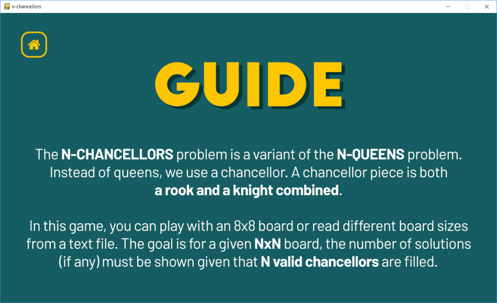

# N Chancellors Problem Solver

Implemented using C for the backtracking.

This was made in partial completion of CMSC 142, developed by:

* David Ralph Benavidez
* Carlos Miguel Canonizado
* Alexander Custodio

## Screenshots

